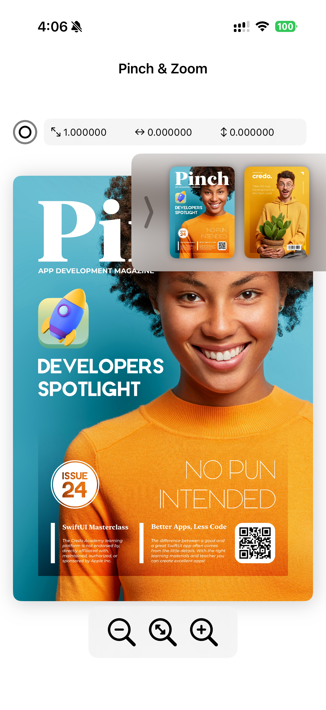
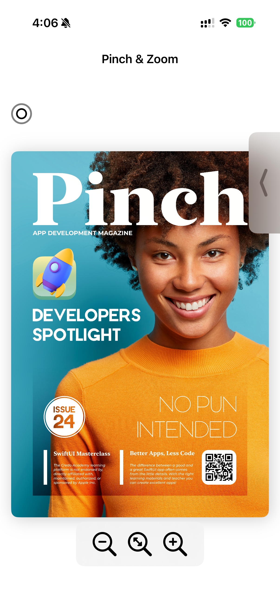
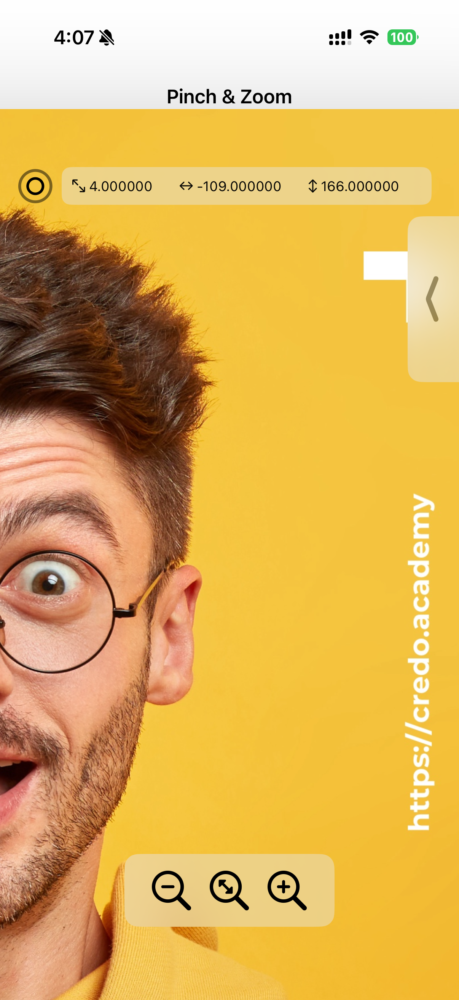

# 🤏 Pinch

Pinch is a SwiftUI iOS application built to explore and practice gesture-based interactions.

The app allows users to interact with magazine-style images using pinch, zoom, drag, double tap, and reset gestures. It is a simple but interactive project created to understand how touch gestures can improve the user experience in iOS applications.

---

## 🚀 Features

- 🔍 Pinch to zoom in and zoom out
- 👆 Drag the image around the screen
- 🔁 Double tap to reset the image
- 🖼️ Interactive image drawer
- 📐 Real-time scale, offset, and rotation values
- 📱 Smooth SwiftUI gesture experience
- 🎨 Clean and modern user interface
- 🧠 Gesture-based learning project

---

## 🛠️ Built With

- SwiftUI
- Swift
- Xcode
- iOS

---

## 📸 Screenshots

### Home Screen

---

### Magazine View

---

### Pinch and Zoom View

---

### Image Drawer

---

### Zoomed View

---

### Second Magazine Screen

---

## 🎥 Demo Video

https://github.com/user-attachments/assets/da83f31e-4188-492d-ac3b-82de37bba129

---

## 📚 What I Learned

While building Pinch, I learned how to work with SwiftUI gestures and how to create a more interactive user experience.

This project helped me understand how to manage image scaling, dragging, offsets, reset actions, and gesture-based controls. It also gave me hands-on practice with building clean and responsive UI components in SwiftUI.

---

## 📂 Repository

GitHub Repo:  
https://github.com/DhruvPatel05/Pinch

---

## 👨‍💻 Author

Dhruv Patel

- LinkedIn: https://www.linkedin.com/in/dhruv-patel-csm/
- GitHub: https://github.com/DhruvPatel05

---

## Support

If you like this project, please consider giving it a star ⭐
